# SHAM

Sharp Handheld Approximation (MicroPython): a fantasy pocket computer in the spirit of the Sharp Wizard and Psion organisers. MicroPython's embed port drives a simulated 299x120 2-bit LCD with an EL backlight. The OS and its apps are plain Python in `os/`, reloaded on save.


<p align="center">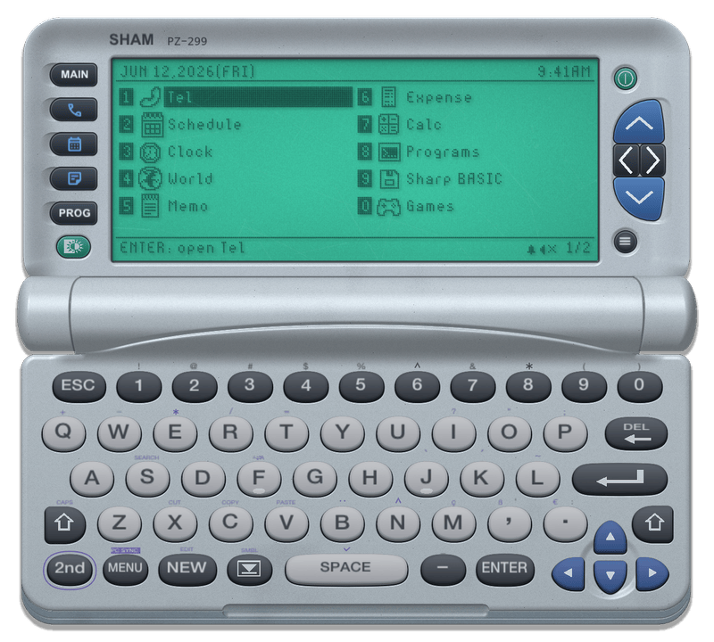</p>

## Screens

| | | |
|:-:|:-:|:-:|
| 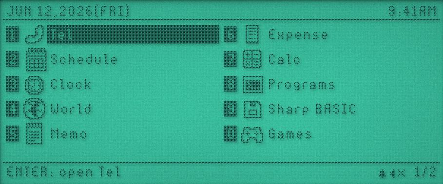 | 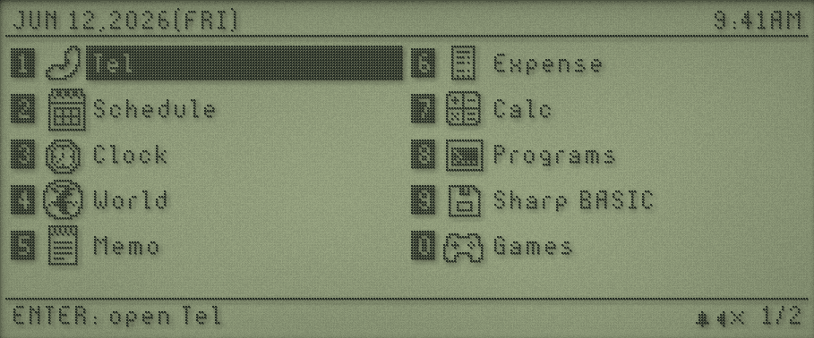 | 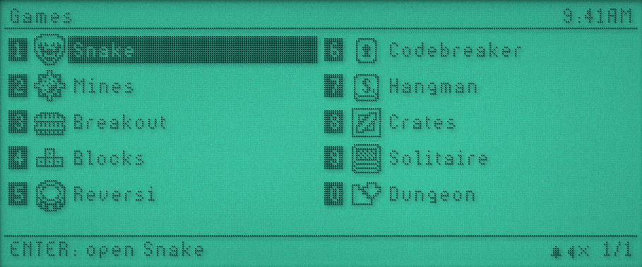 |
| Launcher, with its status bar | The same with the backlight off | Games folder |
| 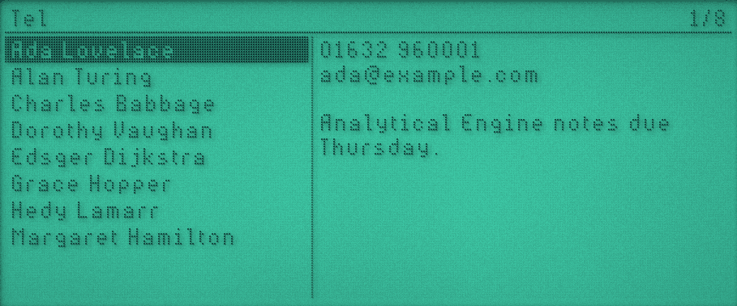 | 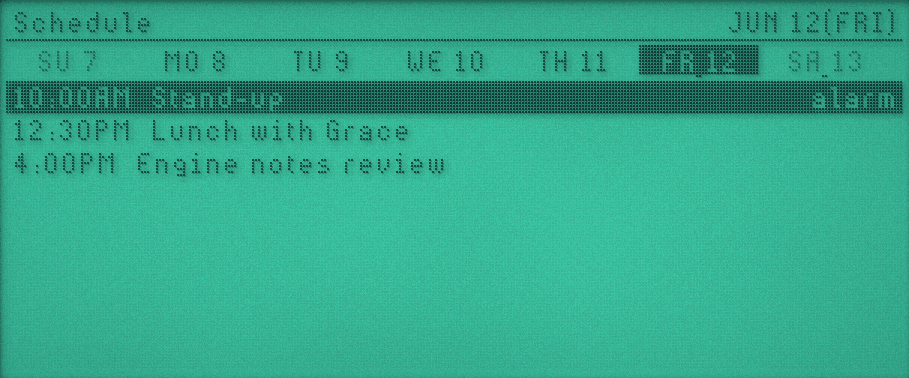 | 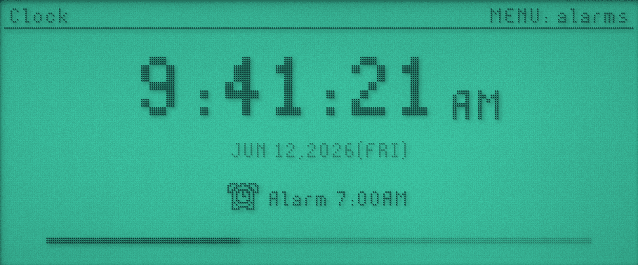 |
| Tel | Schedule | Clock |
| 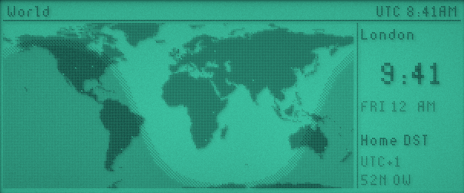 | 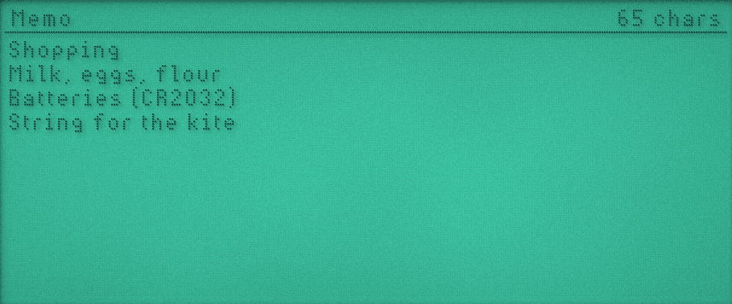 | 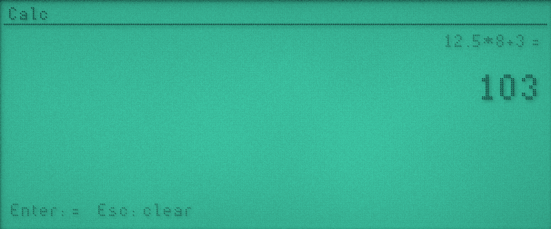 |
| World, with day and night | Memo | Calc |
| 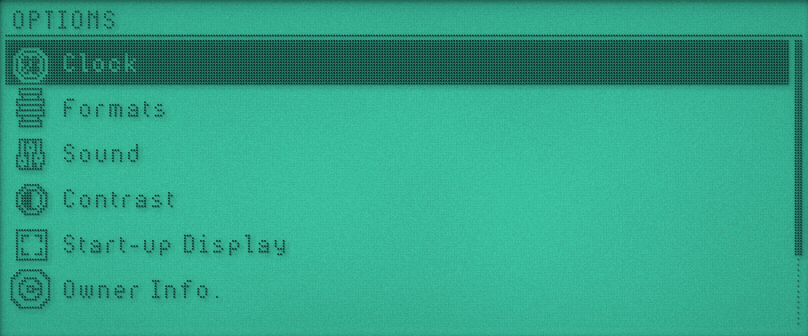 | 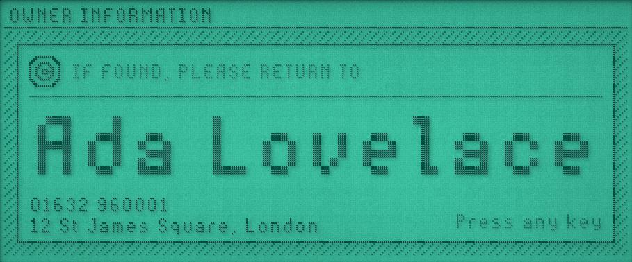 | 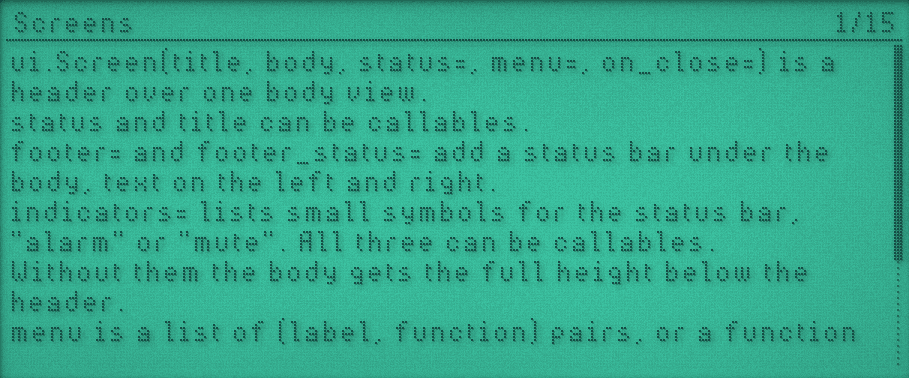 |
| Options | Owner information at start-up | Guide, with the SDK reference |
| 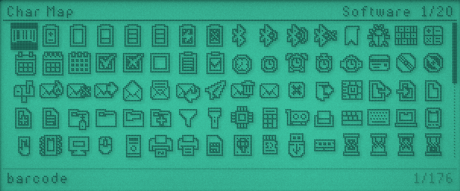 | 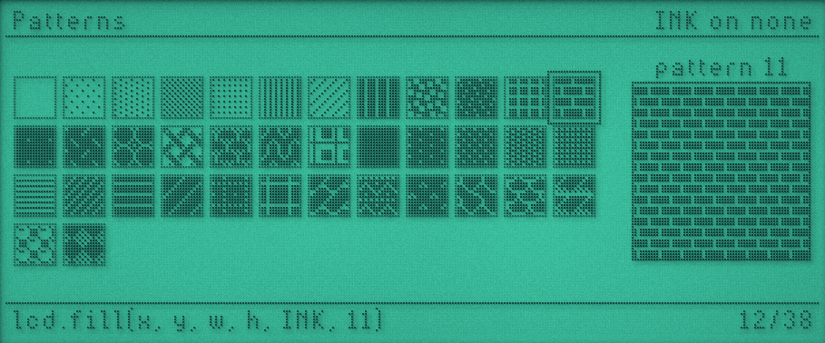 | 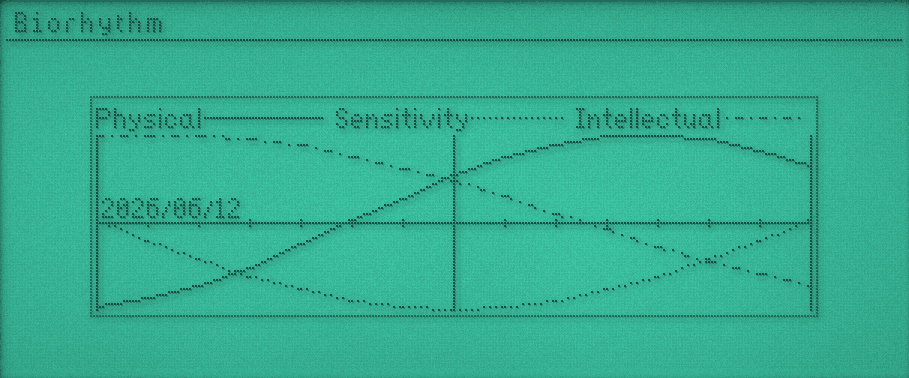 |
| Char Map | Patterns | Sharp BASIC running Sierpinski.wzd |
| 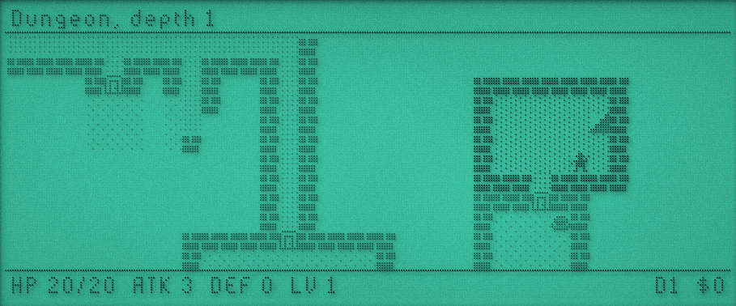 | 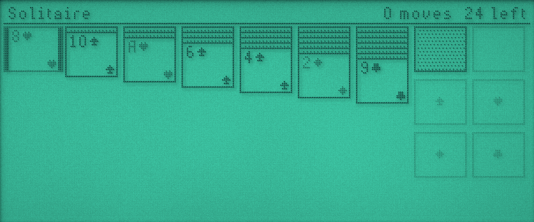 | 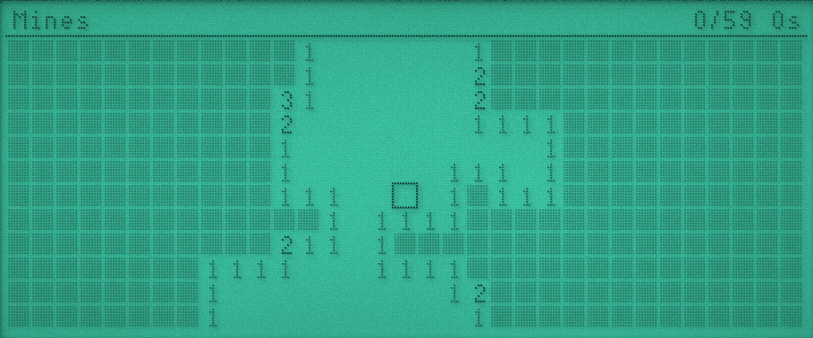 |
| Dungeon | Solitaire | Mines |
| 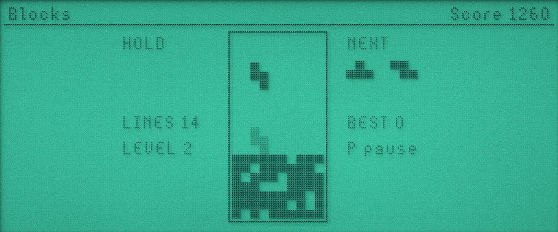 | 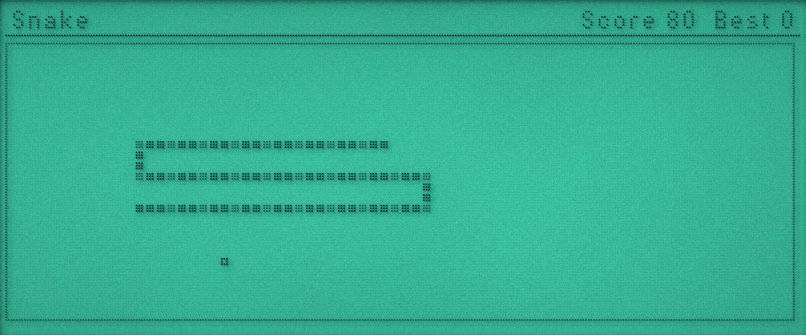 | 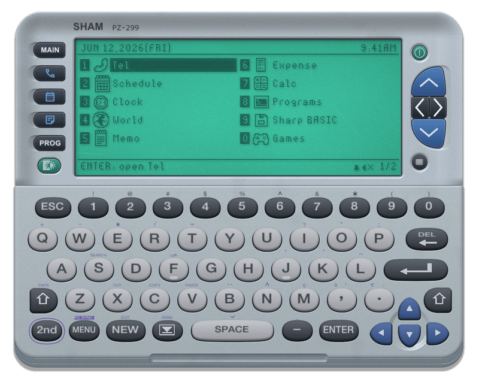 |
| Blocks | Snake | View > Compact |

`make screenshots` regenerates these into `docs/screenshots/` (`tools/readme_screenshots.py`, needs ffmpeg and pngquant): a fixed date and time, sound off, seeded demo data and fixed game seeds. `--lcd=FILE` saves just the LCD, `--lcd-cell=N` sets its pixel size.

## Build

SDL3 and the two submodules, on macOS, Linux or Windows (MSYS2 UCRT64).

```
git submodule update --init
brew install sdl3                  # macOS
sudo apt install libsdl3-dev       # Ubuntu 25.04 or later
pacman -S make git python mingw-w64-ucrt-x86_64-gcc mingw-w64-ucrt-x86_64-pkgconf mingw-w64-ucrt-x86_64-sdl3   # MSYS2 UCRT64

make embed     # once, and after any mpconfigport.h change or new qstr (such as a new lcd constant)
make
make run
make check     # syntax, View shadowing, icons, Crates solvability, launch every app
```

On macOS the menus are in the menu bar with Cmd shortcuts. On Linux and Windows, right-click the window (or press the Menu key) for the same menus, and use Alt where this README says Cmd. `SDL_VIDEO_DRIVER=dummy make check` runs the checks without a display.

## Run

```
./sham                       # boots a per-user copy of os/
./sham --root=os --data=data  # the repo's os/ and data/, as make run does
./sham --keys="{CLICK}{F2}{DOWN}" --screenshot=shot.bmp --frames=120
./sham --exec="ui.alert('hi')"
./sham --no-repl --fps=10 --response=2 --menu=dead-columns
./sham --borderless --compact
```

Key scripts send special keys as real SDL events. `{+LEFT}`/`{-LEFT}` hold and release, `{CLICK}` clicks the device, `{CLICK:0.1,0.2}` clicks at a fraction of the window, `{WAIT}` skips a step.

On first run, the bundled `os/` is copied to `os/` in the per-user directory: `%LOCALAPPDATA%\SHAM` on Windows, otherwise `$XDG_DATA_HOME/sham`, else `~/Library/Application Support/SHAM` on macOS or `~/.local/share/sham` elsewhere. It's never updated after that, so delete it to pick up a newer OS. Writable data and settings live in `data/` beside it. `--root` and `--data` override both.

Saving anything under the root restarts the VM and drops you back into the last app.

Install > Install Program (Cmd-I) or `--install=FILE` copies a Python file into My Programs (`programs/` in the data directory), or a Sharp OZ/ZQ `.wzd` into Sharp BASIC (`wzd/`), replacing one of the same name.

## Keys

| Key | Device |
|-----|--------|
| F1 | MAIN |
| F2 / F3 / F4 / F5 | Tel / Schedule / Memo / Programs |
| F6 | Backlight |
| Tab | MENU |
| Esc | Back |
| Ctrl-C | Interrupt the running app, or cancel the REPL line |
| Cmd-R | Reload (Run menu) |
| Cmd-J | Show or hide the REPL (View menu) |
| Cmd-L | Focus the REPL, Esc to return to the device (View menu) |
| Cmd-B | Backlight (Simulation menu) |
| Cmd-D | Dead LCD columns, re-rolled each time (View > Realism) |

The bezel carries clickable keys: MAIN/TEL/CAL/MEMO/PROG and the backlight on the left, and on the right a split disc of up, ESC, ENTER and down centred on the screen, with POWER above and MENU below. The View menu picks Screen Only, Screen & Frame, Screen & Buttons or Screen & Keyboard (Cmd-K cycles, `--layout=0..3`).

The Screen & Keyboard layout adds the ZQ-770 keyboard below the lid. Click keys to type. 2nd and Shift latch for one keypress, 2nd then Shift toggles CAPS, and 2nd sends each key's purple function. The layout lives in `tools/keyboard_layout.json`, and `make keyboard` regenerates `src/keyboard_layout.h`.

The Simulation menu has Backlight, Sound, Key Click, Frame Rate (unlimited, or 60 down to 10 fps for the device while the window stays smooth) and Response Time (LCD ghosting, instant to very slow). `--fps=N` and `--response=N` set them at launch.

View > Realism groups Dead Columns, Scratches and Wear, which weathers the case and rubs away bits of printed labels.

View > Borderless (Cmd-Shift-B, or `--borderless`) shows only the device on a transparent window, dragged by its case. View > Compact (`--compact`) joins the lid and keyboard without the hinge, and touchscreen mode always uses it.

In a `make TOUCHSCREEN=1` build (macOS only), View > Touchscreen Mode (Cmd-Shift-T, or `--touchscreen[=NAME]`) takes over a touch display, TETRA by default: a borderless window covers it above the menu bar, the REPL hides, the Weida digitizer is read directly over IOHID (single touch, mapped to clicks), and touch targets grow into the gaps between keys. The mode is remembered and re-engages when the display appears. Reading the panel needs Input Monitoring permission for the app or terminal.

Menu settings (REPL, layout, borderless, compact, backlight, dead columns, scratches, wear, frame rate, response time, window size) are saved to `sham.ini` in the data directory. Command-line flags override them, and screenshot runs don't save.

## Sharp BASIC

The Sharp BASIC app runs BASIC programs for the Sharp OZ-7xx and ZQ-7xx organisers straight from their `.wzd` files, without the Sharp firmware. The interpreter (`os/system/sharpbasic/`) reads the tokenised listing and draws into a 239x70 area in the Sharp's own font (`os/fonts/sharp.ppf`, captured from the firmware's output). Files opened as `E:NAME` live in `sharp/` in the data directory. Machine code programs (a `CALL` stub followed by Z80 code) are refused. `os/samples/wzd/Sierpinski.wzd` is copied into `wzd/` on first use; `make samples` rebuilds it from `tools/basic/sierpinski.bas` with `tools/make_wzd.py`.

It was checked against the firmware running in the zq77x-emu emulator: token names, key codes, error numbers, number formatting, `DATE$`/`TIME$` and text widths come from programs run there.

## Layout

| Path | What |
|------|------|
| `src/` | Host: SDL3 window, ImGui REPL, LCD compositor, fiber runtime, `host` and `lcd` modules |
| `os/main.py` | Boots the shell; its globals are the REPL's |
| `os/system/ui.py` | The app SDK: Screen, List, Grid, TextView, TextEdit, Form, Split, Stack, Canvas, dialogs |
| `os/system/` | Shell, fonts, icons, keys, JSON store |
| `os/apps/` | One file per app |

The Guide app on the device documents the SDK.

## Credits

- Icons: [nikoichu's 1-bit Pixel Icons](https://nikoichu.itch.io/pixel-icons), packed by [iconfont-ppf](https://github.com/Gadgetoid/iconfont-ppf), subject to that pack's licence.
- Sins 7 pixel font from Badgeware.
- Fill patterns (`lcd_patterns` in `src/lcd.c`) from Badgeware's PicoVector pattern brush (MIT, Pimoroni).
- Dungeon's patterned walls, floors and fog follow the Badgeware Rogue app.
- World map rasterised by `make worldmap` from Badgeware's `world.geo.json`.
- Key icons: [Material Symbols](https://fonts.google.com/icons) (Apache-2.0, see `licences/`), subset into `assets/MaterialSymbolsKeys.ttf` by `make keyicons` (needs fontTools and the variable font).
- LCD scratches: `assets/lcd_scratches.bin`, generated procedurally by `make scratches` (`tools/make_surface_scratches.py`, needs numpy). `tools/make_scratches.py` can still extract a mask from a scratch photo instead.
- [Dear ImGui](https://github.com/ocornut/imgui) (MIT), [minicoro](https://github.com/edubart/minicoro) (public domain or MIT-0), [dmon](https://github.com/septag/dmon) (BSD-2-Clause).
